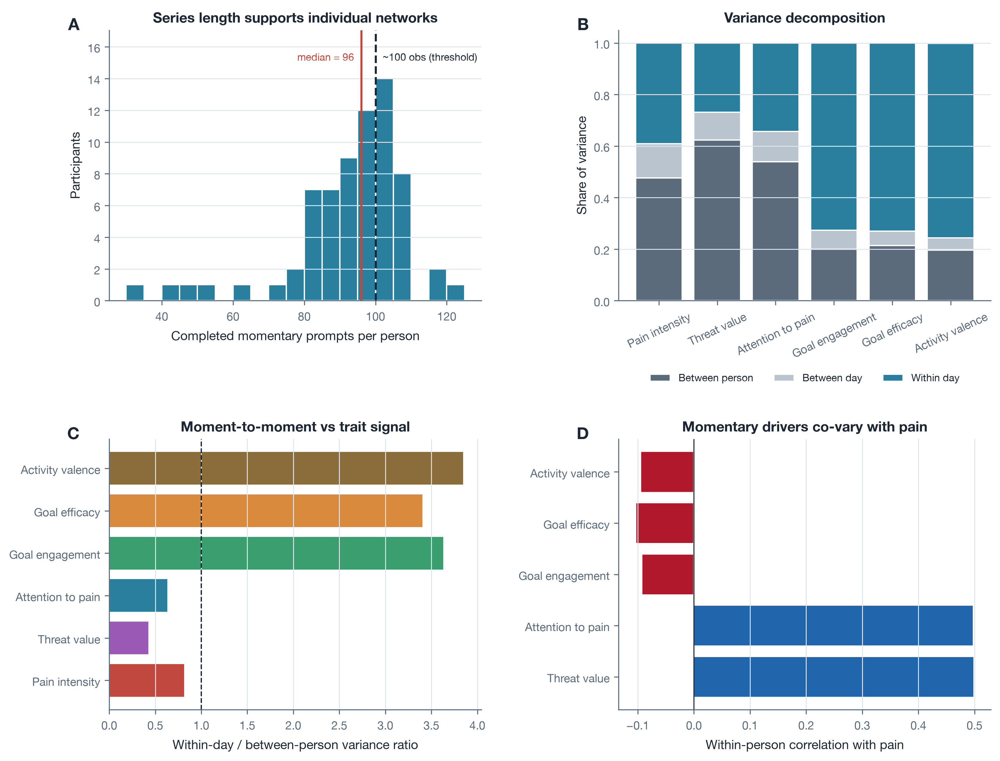
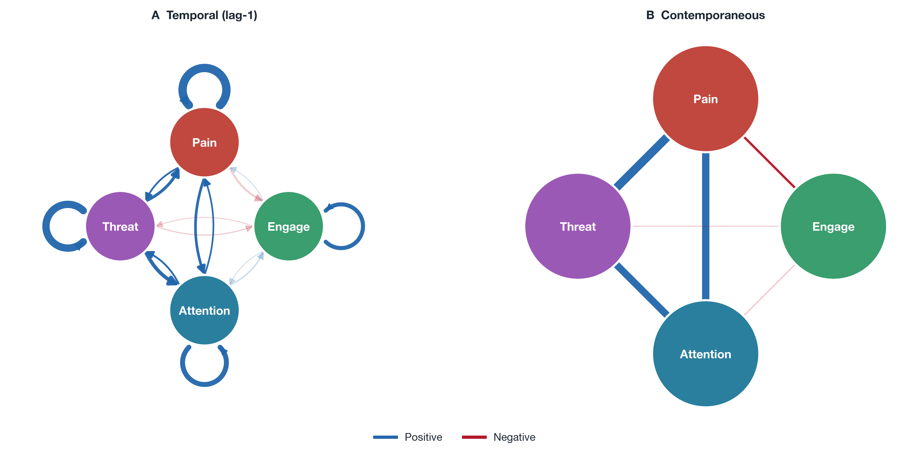
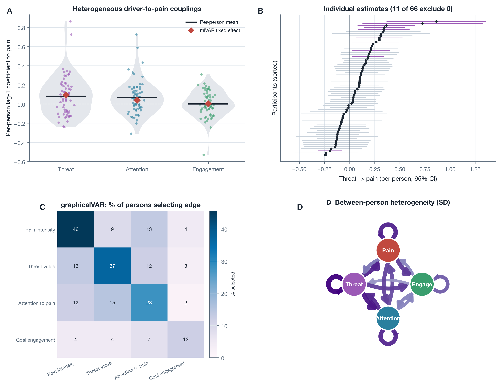
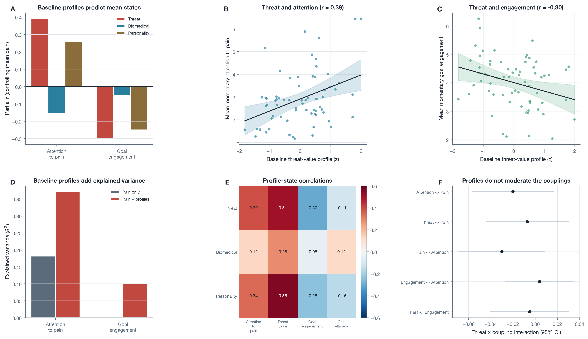

<div align="center">

# Drivers of Daily Pain

### Idiographic network analysis of attention, threat, and activity in chronic pain

Stijn Van Severen<sup>1,*</sup> &middot;
Ilse Viane<sup>1</sup> &middot;
Annick De Paepe<sup>1</sup> &middot;
Geert Crombez<sup>1</sup>

<sup>1</sup> Department of Experimental-Clinical and Health Psychology, Ghent University, Ghent, Belgium<br>
<sup>*</sup> Corresponding author: <a href="mailto:stijn.vanseveren@ugent.be">stijn.vanseveren@ugent.be</a>

[](src/utils/pipeline/separate/07_idiographic_graphicalvar)
[](src/utils/pipeline/full/run_all.py)
[](src/utils/pipeline/full/run_all.py)
[-B7410E)](paper/report/main.tex)

</div>

---

## Table of Contents

- [[O] Overview](#o-overview)
- [[RQ] Research Questions](#rq-research-questions)
- [[R] Key Results](#r-key-results)
- [[M] Method Decision](#m-method-decision)
- [[F] Most Relevant Figures](#f-most-relevant-figures)
- [[D] Repository Structure](#d-repository-structure)
- [[Run] How To Reproduce](#run-how-to-reproduce)
- [[Review] Review Notes](#review-review-notes)

---

## [O] Overview

This repository contains a reproducible analysis pipeline and manuscript for an idiographic
network study of chronic-pain experience-sampling data. The analytic sample contains 68 patients
with chronic pain who completed a momentary diary eight times per day for two weeks (6,262
completed prompts, median 96 per person, range 30 to 122).

The analysis is grounded in the cognitive-affective model of the interruptive function of pain
(Eccleston and Crombez, 1999): pain preferentially recruits attention, the strength of this
recruitment is governed by the threat value of pain rather than by its intensity, and the
resulting capture of attention competes with goal-directed activity. Four momentary nodes
operationalize this model: pain intensity, threat value (the mean of momentary fear and
catastrophizing), attention to pain, and goal engagement. The analysis asks what drives momentary
pain in daily life.

Statistical models are written in R, run from a Python orchestrator, and exported to
manuscript-ready figures and tables. The methodological difference from the fibromyalgia
companion study is series length: there, about 44 prompts per person forced partial pooling
(mlVAR) as the primary model; here the median of 96 prompts per person reaches the length
recommended for individual estimation, so person-specific networks are the primary analysis and
mlVAR is the partial-pooling benchmark.

---

## [RQ] Research Questions

1. How do momentary threat value, attention to pain, and goal engagement relate temporally to
   momentary pain at the level of the individual patient, and how much do these person-specific
   dynamics differ across patients?
2. Are individual differences in the momentary experience of pain accounted for by a baseline
   threat-value profile (catastrophizing, vigilance), over and above a biomedical profile (pain
   severity, duration) and a personality profile (neuroticism)?

---

## [R] Key Results

- A coherent within-person threat-attention-pain circuit emerged in the pooled benchmark: a
  higher than usual threat value predicted a stronger subsequent focus on pain (b = .125, 95
  percent CI [.078, .172]), higher subsequent pain (b = .096, [.047, .145]), pain predicted a
  stronger subsequent focus on pain (b = .083, [.046, .120]), and attention predicted higher
  subsequent pain (b = .038, [.003, .073]). The largest cross-lagged effect ran from threat to
  attention, the momentary counterpart of the model's central claim.
- The average circuit summarized wide heterogeneity: the per-person threat-to-pain coupling
  ranged from -.24 to .86, was individually reliable in 11 of 66 participants, and was positive
  in every participant for whom the regularized individual network selected it.
- Between persons, a baseline threat-value profile predicted more attention to pain (r = .39,
  p = .001) and less goal engagement (r = -.30, p = .01), more specifically than the biomedical
  and personality profiles.
- The circuit reproduced under within-person detrending, a two-item attention measure, a
  stricter compliance criterion, a six-node extension, a threat-component decomposition,
  leave-one-participant-out refitting, and a person-level bootstrap.

---

## [M] Method Decision

The central methodological issue is whether fully individual networks are defensible. Unlike the
fibromyalgia companion study, the series here reach the recommended length:

- The median number of completed prompts is 96, and 65 of 68 participants completed at least 50.
- graphicalVAR therefore fits per-person networks that are sparse but interpretable, recovering a
  shared directional backbone with person-specific magnitudes.
- S-GIMME, run as a confirmatory estimator, recovered the same autoregressive backbone and a
  shared threat-attention-pain cluster.
- mlVAR is retained as the partial-pooling benchmark that stabilizes the average and quantifies
  between-person heterogeneity through random effects.

Person-specific networks are therefore the primary analysis, and the pooled model is the
benchmark, which inverts the emphasis of the fibromyalgia study.

---

## [F] Most Relevant Figures

The main figures that carry the empirical argument are shown here. All main and supplementary
figures are stored under [`paper/assets/figures`](paper/assets/figures).

**MAIN_01: Series length, within-person variance, and pain-driver correlations**



The completed-prompt distribution clusters near the idiographic series-length threshold, and
pain and its drivers carry substantial within-person variance.

**MAIN_02: Pooled benchmark momentary networks**



The temporal network shows the threat-attention-pain circuit; the contemporaneous network is
dominated by the same-prompt threat-pain, attention-pain, and threat-attention associations.

**MAIN_03: Individual heterogeneity in the pain-driver couplings**



The average couplings summarize wide person-to-person variation. Regularized individual networks
are sparse, but the threat-to-pain edge is positive whenever it is selected.

**MAIN_04: Baseline trait profiles and the momentary experience of pain**



A baseline threat-value profile predicts more attention to pain and less goal engagement,
specifically relative to biomedical and personality profiles, but does not moderate the
within-person couplings.

---

## [D] Repository Structure

```text
.
├── paper/
│   ├── assets/
│   │   ├── figures/main/
│   │   ├── figures/supplementary/
│   │   └── tables/
│   └── report/
│       ├── main.tex
│       ├── main.pdf
│       └── references.bib
└── src/
    ├── data/
    │   ├── raw/
    │   └── processed/
    ├── other/                (legacy Outlook data dump; gitignored)
    ├── results/
    │   ├── models/
    │   ├── networks/
    │   ├── tables/
    │   └── REVIEW.md
    └── utils/
        ├── lib/
        ├── study_materials/
        └── pipeline/
            ├── full/run_all.py
            └── separate/01..12
```

---

## [Run] How To Reproduce

### Local Pipeline

```bash
make setup
make run-all
```

Resume from a stage, or run one stage:

```bash
make run-from STAGE=07
make run-stage STAGE=12
```

### Manuscript

```bash
cd paper/report
tectonic main.tex
```

References use natbib plus the bundled `apalike` BibTeX style, so biber is not required. Each
reference carries a clickable DOI.

### Docker

Docker support is in [`docker/`](docker). The image builds from the `docker/` directory only,
so private raw data are not part of the Docker build context. At runtime, Compose mounts the
repository into `/workspace` and runs the same Makefile checks as the local workflow.

```bash
docker compose -f docker/docker-compose.yml build
docker compose -f docker/docker-compose.yml run --rm paper-analysis
```

Raw and processed participant-level data are intentionally excluded from Git. Keep the private
data on the local machine under `src/data/raw/`. The full statistical pipeline also requires the
R modelling packages used by the local workflow (`mlVAR`, `graphicalVAR`, `gimme`, `lme4`,
`lmerTest`, `tseries`).

---

## [Review] Review Notes

The consolidated review guide is in [`src/results/REVIEW.md`](src/results/REVIEW.md). The paper
draft is in [`paper/report/main.tex`](paper/report/main.tex) and compiles to
[`paper/report/main.pdf`](paper/report/main.pdf).

The diary data were collected by Ilse Viane within the FWO project of Geert Crombez and Wilfried
De Corte (G.0032.01). This repository contains an idiographic network analysis of those data.
