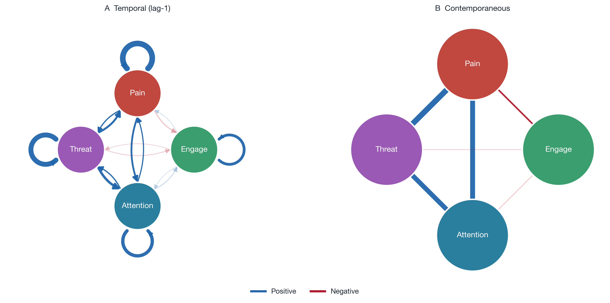
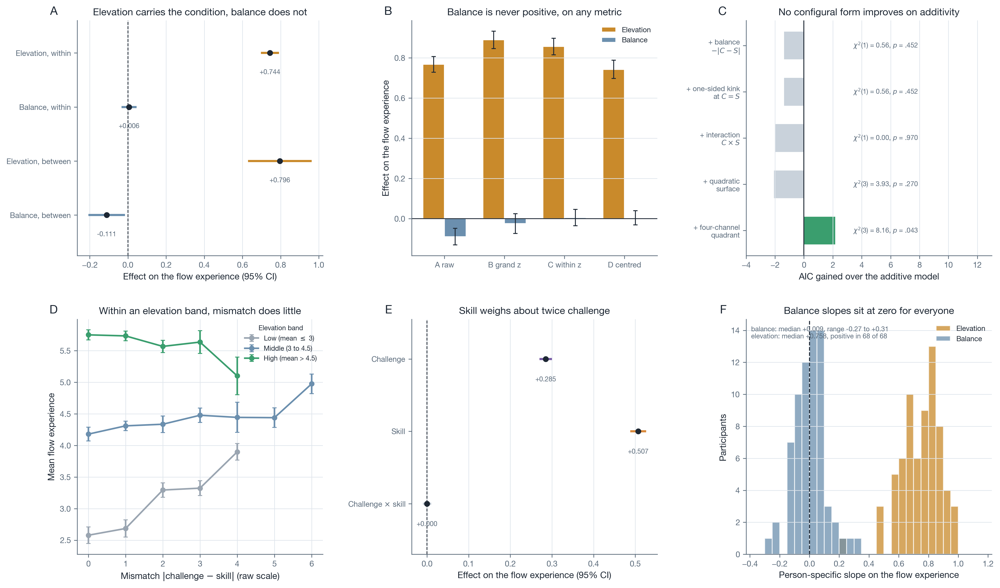

<div align="center">

# Drivers of Pain in Daily Life

### Two manuscripts from one chronic-pain experience-sampling study

Stijn Van Severen<sup>1,*</sup> &middot;
Ilse Viane<sup>1</sup> &middot;
Annick De Paepe<sup>1</sup> &middot;
Geert Crombez<sup>1</sup>

<sup>1</sup> Department of Experimental-Clinical and Health Psychology, Ghent University, Ghent, Belgium<br>
<sup>*</sup> Corresponding author: <a href="mailto:stijn.vanseveren@ugent.be">stijn.vanseveren@ugent.be</a>

[](src/utils/pipeline/separate/07_idiographic_graphicalvar)
[](src/utils/pipeline/full/run_all.py)
[](src/utils/pipeline/full/run_all.py)
[-B7410E)](paper/report)

</div>

---

## Table of Contents

- [[O] Overview](#o-overview)
- [[P] The Two Manuscripts](#p-the-two-manuscripts)
- [[R1] Manuscript 01: Drivers of Pain](#r1-manuscript-01-drivers-of-pain)
- [[R2] Manuscript 02: Decomposing Flow](#r2-manuscript-02-decomposing-flow)
- [[M] Method Decision](#m-method-decision)
- [[D] Repository Structure](#d-repository-structure)
- [[Run] How To Reproduce](#run-how-to-reproduce)
- [[Data] Data Availability](#data-data-availability)
- [[Review] Review Notes](#review-review-notes)

---

## [O] Overview

This repository contains a reproducible analysis pipeline and two manuscripts built on one
chronic-pain experience-sampling dataset. Sixty-eight patients with chronic pain completed a
momentary diary eight times per day for two weeks (6,262 completed prompts, median 96 per
person, range 30 to 122), together with a brief morning and evening diary and a battery of
baseline questionnaires.

Statistical models are written in R, run from a Python orchestrator, and exported to
manuscript-ready figures and tables. Every number in either paper is regenerated from the
processed data by the pipeline; nothing is hand-typed into the manuscripts.

---

## [P] The Two Manuscripts

The dataset answers two questions that do not belong in one paper. They share a sample, a
preprocessing stage, and a modelling engine, and they cross-reference each other, but their
claims, audiences, and node sets differ.

| | **01 Drivers of Pain** | **02 Decomposing Flow** |
| --- | --- | --- |
| Question | What drives momentary pain in daily life? | Does the flow construct hold together when measured moment by moment? |
| Model | Four-node within-person temporal networks | Nested multilevel models of a constructed measure |
| Nodes / items | pain, threat value, attention to pain, goal engagement | challenge, skill, absorption, enjoyment, against four pain measures |
| Primary estimator | graphicalVAR per person, mlVAR benchmark, S-GIMME confirmatory | multilevel models with random slopes, likelihood-ratio comparison |
| Headline | A shared but person-specific threat-attention-pain circuit | The condition is additive, not configural, and the composite hides a sign reversal |
| Manuscript | [`paper/report/01_manuscript_DeterminantsOfPain`](paper/report/01_manuscript_DeterminantsOfPain/main.tex) | [`paper/report/02_manuscript_FlowInducedAnalgesia`](paper/report/02_manuscript_FlowInducedAnalgesia/main.tex) |
| Assets | [`paper/assets/01_...`](paper/assets/01_manuscript_DeterminantsOfPain) | [`paper/assets/02_...`](paper/assets/02_manuscript_FlowInducedAnalgesia) |
| Built by | pipeline stage 13 | pipeline stages 12 and 14 |

The absorption item appears in both papers. Manuscript 01 treats it as goal engagement, the
goal-directed activity that pain interrupts, with no flow framing; manuscript 02 treats it as one
of the four constituents of flow. The two papers use the label consistently and refer to each
other in the Method.

---

## [R1] Manuscript 01: Drivers of Pain

**Drivers of Pain in Daily Life: An EMA-Based Idiographic Network Analysis of Attention, Threat,
and Activity Engagement in Chronic Pain**

Guided by the cognitive-affective model of the interruptive function of pain (Eccleston and
Crombez, 1999), momentary pain is modelled together with its threat value, attention to pain, and
goal engagement.

**Research questions**

1. How do momentary threat value, attention to pain, and goal engagement relate temporally to
   momentary pain at the level of the individual patient, and how much do these person-specific
   dynamics differ across patients?
2. Are individual differences in the momentary experience of pain accounted for by a baseline
   threat-value profile (catastrophizing, vigilance), over and above a biomedical profile (pain
   severity, duration) and a personality profile (neuroticism)?

**Key results**

- A coherent within-person threat-attention-pain circuit emerged in the pooled benchmark: a
  higher than usual threat value predicted a stronger subsequent focus on pain (b = .125, 95
  percent CI [.078, .172]), higher subsequent pain (b = .096, [.047, .145]), pain predicted a
  stronger subsequent focus on pain (b = .083, [.046, .120]), and attention predicted higher
  subsequent pain (b = .038, [.003, .073]). The largest cross-lagged effect ran from threat to
  attention, the momentary counterpart of the model's central claim.
- The average circuit summarized wide heterogeneity: the per-person threat-to-pain coupling
  ranged from -.24 to .86, was individually reliable in 11 of 66 participants, and was positive
  in every participant for whom the regularized individual network selected it.
- Between persons, a baseline threat-value profile predicted more attention to pain (r = .39,
  p = .001) and less goal engagement (r = -.30, p = .013), more specifically than the biomedical
  and personality profiles, but it did not moderate the within-person couplings.
- The circuit reproduced under within-person detrending, a two-item attention measure, a
  stricter compliance criterion, a six-node extension, a threat-component decomposition,
  leave-one-participant-out refitting, and a person-level bootstrap.

**Most relevant figure**



The temporal network shows the threat-attention-pain circuit; the contemporaneous network is
dominated by the same-prompt threat-pain, attention-pain, and threat-attention associations. The
remaining figures are in
[`paper/assets/01_manuscript_DeterminantsOfPain/figures`](paper/assets/01_manuscript_DeterminantsOfPain/figures).

---

## [R2] Manuscript 02: Decomposing Flow

**Flow Is Not More Than Its Parts: Decomposing the Challenge-Skill Model and Its Momentary
Association with Chronic Pain**

Four diary items map onto Csikszentmihalyi's flow model: challenge and skill form the antecedent
condition, absorption and enjoyment the experience. The paper tests the two structural
assumptions that experience-sampling operationalizations of flow usually build in rather than
test, and then asks whether the flow experience accompanies or precedes a better experience of
pain. Every flow variable is a secondary, analyst-constructed measure: the source study analysed
these items separately and never as a flow index.

**Research questions**

1. Does the challenge-skill condition relate to the momentary flow experience configurationally,
   as the channel model requires, or additively?
2. Does the flow composite carry information about the momentary experience of pain that its four
   constituents, entered separately, do not?
3. Is the momentary flow experience associated with a better experience of pain in daily life,
   concurrently and prospectively, and is the flow channel the least painful region of the
   challenge-skill plane?

**Key results**

- **Additive, not configural.** Balance (the negative absolute challenge-skill discrepancy) added
  nothing to an additive model of challenge and skill, chi-square(1) = 0.56, p = .45, and neither
  did a one-sided kink at equality, a multiplicative interaction, or a full second-order response
  surface (all p >= .27). The four-channel quadrant scheme reached p = .043 but was rejected by
  BIC. Between persons the balance effect reversed: better-matched activity went with less flow
  experience (b = -.111, p = .028).
- **The composite hides a sign reversal.** Entered jointly, absorption (b = -.055) and skill
  (b = -.045) tracked lower pain, enjoyment fell to non-significance, and challenge reversed sign
  and tracked higher pain (b = +.032, p = .004). Using all four constituents instead of the
  composite improved fit for every pain outcome (all p < .001). Substituting the composite for
  the single absorption node in the manuscript 01 benchmark network reproduced 22 parameters at
  r = .997 with no change of sign or significance.
- **Co-occurrence, not analgesia.** The flow experience accompanied less pain interference
  (b = -.139), lower pain (b = -.094), lower threat (b = -.079), and less attention to pain
  (b = -.074, all p < .001) at the same prompt, but no lag-1 effect reached significance in
  either direction while autoregressive effects in the same models stayed large (.27 to .40).
- **Relaxation, not flow.** The least painful region of the challenge-skill plane was the
  low-challenge, high-skill relaxation channel, which beat flow on interference, attention, and
  threat and matched it on intensity.

**Most relevant figure**



No configural functional form improves on the additive model, on any standardization metric or
for any participant. The remaining figures are in
[`paper/assets/02_manuscript_FlowInducedAnalgesia/figures`](paper/assets/02_manuscript_FlowInducedAnalgesia/figures).

---

## [M] Method Decision

The central methodological issue for manuscript 01 is whether fully individual networks are
defensible. Unlike the fibromyalgia companion study, the series here reach the recommended
length:

- The median number of completed prompts is 96, and 65 of 68 participants completed at least 50.
- graphicalVAR therefore fits per-person networks that are sparse but interpretable, recovering a
  shared directional backbone with person-specific magnitudes.
- S-GIMME, run as a confirmatory estimator, recovered the same autoregressive backbone and a
  shared threat-attention-pain cluster.
- mlVAR is retained as the partial-pooling benchmark that stabilizes the average and quantifies
  between-person heterogeneity through random effects.

The central methodological issue for manuscript 02 is that a balance term built from an absolute
difference is only interpretable if a point on the challenge scale means the same as a point on
the skill scale. Every configural claim is therefore also tested in forms that keep challenge and
skill in their own metric (interaction, quadratic response surface, quadrant classification), and
every comparison is nested so that a likelihood-ratio test applies.

---

## [D] Repository Structure

```text
.
├── paper/
│   ├── assets/
│   │   ├── 01_manuscript_DeterminantsOfPain/{figures,tables}/{main,supplementary}/
│   │   └── 02_manuscript_FlowInducedAnalgesia/{figures,tables}/{main,supplementary}/
│   └── report/
│       ├── 01_manuscript_DeterminantsOfPain/{main.tex,main.pdf,references.bib}
│       └── 02_manuscript_FlowInducedAnalgesia/{main.tex,main.pdf,references.bib}
└── src/
    ├── data/
    │   ├── raw/                (gitignored)
    │   └── processed/          (gitignored)
    ├── other/                  (legacy Outlook data dump; gitignored)
    ├── results/
    │   ├── models/
    │   ├── networks/
    │   ├── tables/
    │   └── REVIEW.md
    └── utils/
        ├── lib/                (paths, common.R, vizstyle, netviz, latextab)
        ├── study_materials/
        └── pipeline/
            ├── full/run_all.py
            └── separate/01..14
                 01 preprocessing            08 baseline trait profiles
                 02 descriptives             09 network and trait link
                 03 variance decomposition   10 robustness
                 04 stationarity/missingness 11 dysfunction dynamics
                 05 mlVAR                    12 flow states
                 06 S-GIMME                  13 manuscript 01 figures and tables
                 07 idiographic graphicalVAR 14 manuscript 02 figures and tables
```

---

## [Run] How To Reproduce

### Local Pipeline

```bash
make setup
make run-all
```

Resume from a stage, or run one stage:

```bash
make run-from STAGE=07
make run-stage STAGE=14
```

### Manuscripts

```bash
make paper
```

or compile one of them directly:

```bash
cd paper/report/02_manuscript_FlowInducedAnalgesia && tectonic --reruns 4 main.tex
```

References use natbib plus the bundled `apalike` BibTeX style, so biber is not required. Each
reference carries a clickable DOI, and every DOI in both bibliographies has been checked against
Crossref.

### Docker

Docker support is in [`docker/`](docker). The image builds from the `docker/` directory only,
so private raw data are not part of the Docker build context. At runtime, Compose mounts the
repository into `/workspace` and runs the same Makefile checks as the local workflow.

```bash
docker compose -f docker/docker-compose.yml build
docker compose -f docker/docker-compose.yml run --rm paper-analysis
```

The full statistical pipeline requires the R modelling packages used by the local workflow
(`mlVAR`, `graphicalVAR`, `gimme`, `lme4`, `lmerTest`, `tseries`).

---

## [Data] Data Availability

Raw and processed participant-level data are intentionally excluded from Git; keep the private
data on the local machine under `src/data/raw/`. Derived exports that carry one row per
participant or one row per prompt are excluded as well, so the committed result files are
aggregate model output only. Stages that read those exports (the per-person figures in
particular) therefore need the pipeline to be run locally; the figures they produce are committed
as images.

---

## [Review] Review Notes

The consolidated review guide is in [`src/results/REVIEW.md`](src/results/REVIEW.md). The flow
construct has its own specification and decision record in
[`src/utils/pipeline/separate/12_flow_states/flow_analysis/flow_operationalization.md`](src/utils/pipeline/separate/12_flow_states/flow_analysis/flow_operationalization.md).

The diary data were collected by Ilse Viane within the FWO project of Geert Crombez and Wilfried
De Corte (G.0032.01). This repository contains a secondary analysis of those data.
